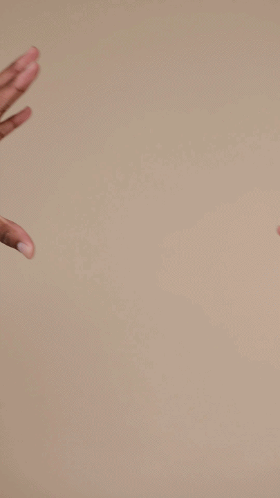

# Video-Edge-Outliner

Python script to convert videos to a video map of the object edges. It will open a cv2 window showing output frames as it processes.


Original             |  Output
:-------------------------:|:-------------------------:
| 

It works well in an environment when there is a plain background and well-distinguishable objects, but it's a lot more noisy and inconsistent on most videos.

## Inspiration
I was inspired by the music video for Porter Robinson's "Look at the Sky" (https://www.youtube.com/watch?v=PuMz4v5PYKc), where he has abstract line art during the choruses. I wanted to make an edge detector so that I could make similar line art if I wanted to make a music video in the future, without requiring any artistic skill. I also wanted to learn a bit about CV to apply to a university design team in the future, so this worked out well as a beginner introduction to computer vision.

## Setup
### Instructions for Using the .exe from Release
Once the exe.file has been downloaded, run the following command
```
video-edge-outliner.exe <PATH_TO_VIDEO>
```

You can also specify optional thresholds for the Canny Edge Detection with
```
video-edge-outliner.exe <PATH_TO_VIDEO> --low_threshold=<VALUE> --high_threshold=<VALUE>
```
**LOW THRESHOLD DEFAULTS TO 50, AND HIGH THRESHOLD DEFAULTS TO 120**. The low threshold should also be below the value of the high threshold, and both values should be integers.

Once the process is finished, the output video will be saved as ```./output/<VIDEONAME>_output.mp4```.

### Instructions for Cloning the Repository on Windows

Cloning Repository
```
git clone https://github.com/IridescentSky/Video-Edge-Outliner.git
cd Video-Edge-Outliner
```

Setting up virtual environment and installing requirements
```
python -m venv .venv
.venv/Scripts/activate
pip install -r requirements.txt
```

Running on a video
```
python main.py <PATH_TO_VIDEO>
```

You can also set optional Low_Threshold and High_Threshold options that control the bounds for Canny Edge Detection with 
```
python main.py <PATH_TO_VIDEO> --low_threshold=<VALUE> --high_threshold=<VALUE>
```
**LOW THRESHOLD DEFAULTS TO 50, AND HIGH THRESHOLD DEFAULTS TO 120**

Once the process is finished, the output video will be saved as ```./output/<VIDEONAME>_output.mp4```.
